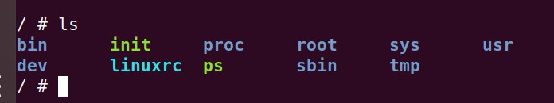
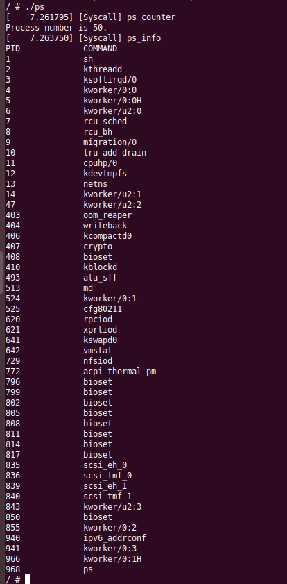
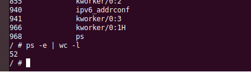
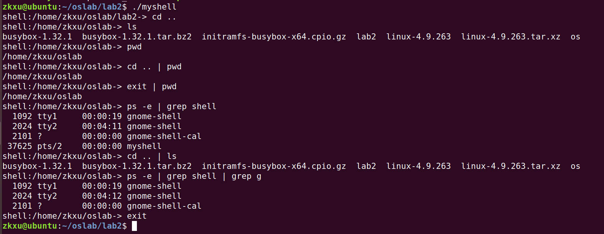

# OS Lab2 实验报告

<font size="5">PB19020683 许子恺  2021.5.9</font>

[TOC]

## 1. 编写系统调用实现一个 Linux ps

### 1.1  实验设计

本实验需要编写系统调用来从内核空间获取数据，并传递到用户空间进行编辑、输出。此次计划获取的信息是进程数、进程PID和进程名。其中进程数较易得到和传递，仅需在遍历所有进程时将记录进程数的 counter 不断加一即可。而对于后两个信息，由于未知进程数大小，无法在用户空间定义变长的数据结构，所以采取了分两个系统调用进行的办法。

第一个系统调用 ps_counter 获取进程数的大小并拷贝到用户空间， 然后通过进程数和 malloc 定义结构体的大小，PID和进程名储存在每个结构体中。第二个系统调用 ps_info 在遍历所有进程时将数据拷贝到结构体中，从而能在用户空间输出。

### 1.2 具体实现

本实验在实现时在`` syscall_64.tbl ``中注册了两个系统调用，分别是：

```c
548 common ps_counter sys_ps_counter
549 common ps_info    sys_ps_info
```

前者用于获取此时的进程数，后者用于获取每个进程的PID和进程名。而在``syscalls.h ``中定义的函数原型如下：

```c
asmlinkage long sys_ps_counter(int __user * num);
asmlinkage long sys_ps_info(struct Process __user * process);
```

前者传递的参数为一个 int 指针，后者为结构体数组指针。此处所用结构体定义为：

```c
struct Process{
        int pid;
        char command[16];
};
```

该结构体的 pid 用于保存进程的 PID，command 用于保存进程的名字。此处采用16个字符是因为可从`` sched.h ``中读到如下信息：

```c
#define TASK_COMM_LEN 16
char comm[TASK_COMM_LEN];
```

在`` sys.c ``中实现的函数为：

```c
SYSCALL_DEFINE1 (ps_counter, int __user *, num) {
        struct task_struct* task;
        int counter = 0;
        printk("[Syscall] ps_counter\n");
        for_each_process(task) {
            	// 遍历，每个进程都使counter加一
                counter ++;
        }
    	// 将counter拷贝到用户空间
        copy_to_user(num, &counter, sizeof(int));
        return 0;
}

SYSCALL_DEFINE1 (ps_info, struct Process __user *, process) {
        struct task_struct* task;
    	int counter = 0;
        printk("[Syscall] ps_info\n");
        for_each_process(task) {
            	// 遍历，并将PID和进程名都拷贝到用户空间
                copy_to_user(&(process+counter)->pid, &task->pid, sizeof(int));
                copy_to_user(&(process+counter)->command, &task->comm, sizeof(task->comm));
                counter++;
        }
        return 0;
}
```

而最终的测试代码为：

```c
int main(void){
        int result;
        syscall(548, &result);
        printf("Process number is %d.\n", result);
    	// 通过result和malloc函数定义结构体数组大小
        struct Process* process = (struct Process*)malloc(result*sizeof(struct Process));
        syscall(549, process);
        printf("PID\t\tCOMMAND\n");
        for(int i = 0; i < result; i++){
                printf("%d\t\t%s\n",(process+i)->pid, (process+i)->command);
        }
        free(process);
        return 0;
}
```

此处已省略头文件和结构体定义，详见源代码。

### 1.3  结果测试

首先利用如下指令编译可执行文件并放入 _install 文件下

```c
gcc -static -o ps process_status.c
```

在制作好 initramfs 文件并编译好 linux 后，以无图形界面形式启动 qemu，利用 ls 指令可看到 qemu 中已有 ps 文件

	

之后以`` ./ps ``命令执行，可以看到结果为

	

由输出可知，首先调用了 ps_counter 得到了进程数为 50， 然后调用了 ps_info 输出了进程 PID 及名称。再使用`` ps -e | wc -l ``命令查看进程数，结果为 52

			

考虑到拿来统计进程数的进程本身和此外`` wc -l ``多算的两行，两个结果均为 49，可以成功验证程序结果与实际进程数符合。 


------


## 2. 实现一个 Linux Shell

### 2.1 实验设计

本实验为补全代码实现一个linux shell，难点在主函数中对 pipe 的建立和读写口开关等。

#### 2.1.1 没有管道的单一命令

先直接通过 split_spring 函数得到 argc、argv两个参数。对于内建命令，直接在主进程中完成。对于外部命令，fork 出一个子进程执行该命令，且在父进程加入等待语句使其等待子进程完成。

#### 2.1.2 两个命令的管道

先建立一个管道 pipe，然后在父进程中 fork 出两个子进程。

对于第一个子进程，关闭 pipe 读端，将标准输出通过写端重定向到 pipe，然后关闭写端。再通过 split_string 函数得到 command[ 0 ] 的argc、argv，执行封装好的 execute 函数。

对于第二个子进程，关闭 pipe 写端，将标准输入通过读端重定向到 pipe，然后关闭读端。再通过 split_string 函数得到 command[ 1 ] 的argc、argv，执行封装好的 execute 函数。

最后还要将父进程的读端写端均关闭。

#### 2.1.3  三个以上的命令

根据命令数 cmd_count 建立 for 循环。由于只需 cmd_count - 1 个管道，所以除最后一次循环外，父进程中每次均建立一个管道。

在每次循环中，fork 出一个子进程，子进程中需对管道进行如下操作：

* 除最后一次循环外，先关闭当前管道的读端，通过写端将标准输出重定向到当前管道，然后关闭当前写端
* 除第一次循环外，通过上一个管道的读端将标准输入重定向到上一个管道，然后关闭上一个管道的读端

然后再通过 split_spring 函数分离argc、argv，执行第 i 条命令。

而在父进程中，由于父进程从不写，且保留的上一个管道的写端在子进程用完关闭后自己也该关闭，所以在循环末尾有：

* 除第一次循环外，关闭上一个管道的读端，即 read_fd
* 除最后一次循环外，关闭当前管道的写端，保存当前管道写端到 read_fd

至此，每个管道的读端写端在父进程和子进程中均得到了关闭。

### 2.2 具体实现

对于 exec_buildin 函数，执行cd、pwd、exit 三个内建命令分别使用了 chdir、getpwd、exit 函数，具体代码如下：

```c
if (strcmp(argv[0], "cd") == 0) {
        if (chdir(argv[1]))
            printf("Error:no such dictionary!\n");
        return 0;
    } else if (strcmp(argv[0], "pwd") == 0) {
        char path[4096];
        getcwd(path, 4096);
        printf("%s\n", path);
        return 0;
    } else if (strcmp(argv[0], "exit") == 0){
       exit(0);
    } else {
        // 不是内置指令时
        return -1;
    }
```

由于 Linux 完整文件路径长度最大为4096，所以此处定义 path 长为4096。

对于 execute 函数，外部命令的执行使用了 execvp 函数，代码如下：

```c
execvp(argv[0], argv);
return 1;
```

其中`` return 1 ``是当 execvp 执行出现问题时表示出现异常。

对于增加打印目录，类似pwd，同样使用了 getcwd 函数：

```c
/* TODO:增加打印当前目录，格式类似"shell:/home/oslab ->"，你需要改下面的printf */
char path[4096];
getcwd(path, 4096);
printf("shell:%s-> ", path);
```

对于主函数中的处理参数，均使用了 split_spring 函数，并在 argv 末尾添加了一个 NULL，这是因为 execvp 函数需要 argv 的末尾为NULL。当为没有管道的单一命令时：

```c
/* TODO:处理参数，分出命令名和参数 */
int argc = split_string(commands[0], " ", argv);
argv[argc] = NULL;
```

其余补全部分为：在子进程中执行外部命令，同时父进程等待子进程完成。``exit(255)`` 为异常处理。

```c
/* TODO:创建子进程，运行命令，等待命令运行结束 */
if (pid == 0) {
	execvp(argv[0], argv);
	exit(255);
}
while(wait(NULL) > 0);
```

当为两个命令间的管道时，依据设计实现如下，详见注释：

```c
// 子进程1
int pid = fork();
if(pid == 0) {
	/*TODO:子进程1 将标准输出重定向到管道，注意这里数组的下标被挖空了要补全*/
    // 先关读端，重定向后再关写端
    close(pipefd[READ_END]);
    dup2(pipefd[WRITE_END], STDOUT_FILENO);
    close(pipefd[WRITE_END]);
    char *argv[MAX_CMD_ARG_NUM];
    int argc = split_string(commands[0], " ", argv);
    argv[argc] = NULL;
    execute(argc, argv);
    exit(255);
}
// 子进程2
pid = fork();
if(pid == 0) {
	/* TODO:子进程2 将标准输入重定向到管道，注意这里数组的下标被挖空了要补全 */
    // 先关写端，重定向后再关读端
	close(pipefd[WRITE_END]);
	dup2(pipefd[READ_END], STDIN_FILENO);
	close(pipefd[READ_END]);
	char *argv[MAX_CMD_ARG_NUM];
    /* TODO:处理参数，分出命令名和参数，并使用execute运行*/
    int argc = split_string(commands[1], " ", argv);
    argv[argc] = NULL;
	execute(argc, argv);
	exit(255);
}
```

对于三个以上的命令，具体实现如下，详见注释：

```c
int read_fd;    // 上一个管道的读端口（出口）
for(int i=0; i<cmd_count; i++) {
	int pipefd[2];
	/* TODO:创建管道，n条命令只需要n-1个管道，所以有一次循环中是不用创建管道的*/
	if (i != cmd_count - 1) {
		int ret = pipe(pipefd);
        // 判断管道是否成功创建
		if(ret < 0) {
			printf("pipe error!\n");
			continue;
		}
	}
	int pid = fork();
	if(pid == 0) {
		/* TODO:除了最后一条命令外，都将标准输出重定向到当前管道入口*/
		if (i != cmd_count - 1) {
            // 关读端，重定向完关写端
			close(pipefd[READ_END]);
			dup2(pipefd[WRITE_END], STDOUT_FILENO);
			close(pipefd[WRITE_END]);
		}	
		/* TODO:除了第一条命令外，都将标准输入重定向到上一个管道入口*/
		if (i != 0) {
            // 重定向完关闭上一个管道的读端
			dup2(read_fd, STDIN_FILENO);
			close(read_fd);
		}
		/* TODO:处理参数，分出命令名和参数，并使用execute运行 */
		char *argv[MAX_CMD_ARG_NUM];
		int argc = split_string(commands[i], " ", argv);
		argv[argc] = NULL;
		execute(argc, argv);
		exit(255);
	}
	// 下面为父进程
	if (i != 0)
		// 关闭上一个管道的读端
		close(read_fd);
	if (i != cmd_count - 1) {
		// 关闭当前管道写端，并保存读端到 read_fd
		close(pipefd[WRITE_END]);
		read_fd = pipefd[READ_END];
	}
}
// TODO:等待所有子进程结束
while (wait(NULL) > 0);
}
```

### 2.3 结果测试

使用如下命令编译可执行文件

```c
gcc -o myshell shell.c
```

然后执行 ``./myshell`` 并进行测试，结果如下

		

对应任务评分规则的三条，上图均进行了测试：

* 支持基本的单条命令运行，且命令行上能显示当前目录

  ```c
  cd .. 
  ls
  pwd
  exit
  ```

* 支持两条命令间的管道和内建命令（只要求cd/exit）

  ```c
  cd .. | pwd
  exit | pwd
  ps -e | grep shell
  cd .. | ls
  ```

* 支持多条命令间的管道操作

  ```c
  ps -e | grep shell | grep g
  ```

由结果可知，该 shell 成功实现了上述功能。